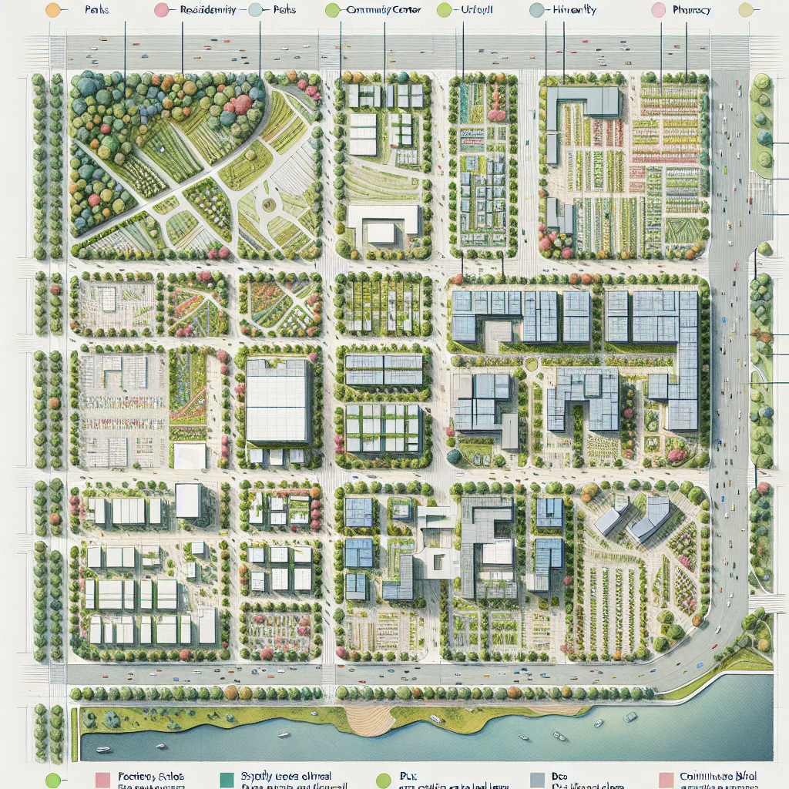
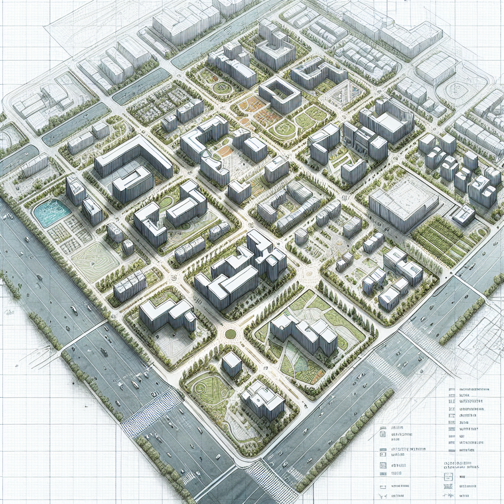
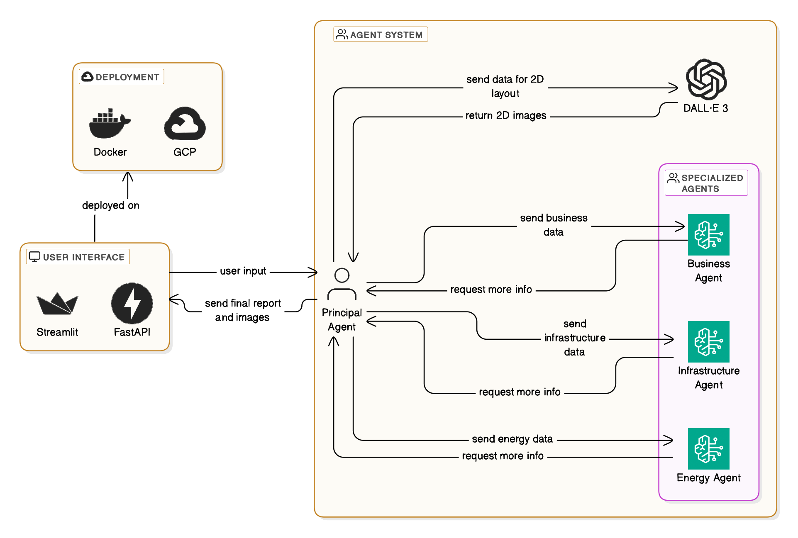

# **Urban Bloom** - The Intelligent City Builder

  

Urban Bloom is a multi-agent system designed to generate eco-friendly city plans based on user input. The system uses specialized AI agents for business, infrastructure, energy, and vision planning, coordinated by a central agent. The user interacts with the system via a web interface built with Streamlit and FastAPI, deployed with Docker on Google Cloud Platform (GCP).

The system processes user input,such as project details (population, surface area), and uses AI agents to generate a comprehensive city plan.  

Agents:  
1. Principal Agent: Coordinates communication and handles user input.  
2.	Business Agent: Manages budget and financial details (via Claude Sonnet 3.5 on AWS Bedrock).  
3.	Infrastructure Agent: Plans building placement and neighborhood details (via Claude Sonnet 3.5).  
4.	Energy Agent: Recommends energy sources and sustainability practices (via Claude Sonnet 3.5).  
5.	Vision Agent: Generates 2D neighborhood visuals (via DALL·E 3 on OpenAI API).  

Process Flow:  
1.	User Input: Upload a screenshot and provide project details.
2.	Agent Coordination: The Principal Agent sends input to specialized agents for processing.
3.	Final Report: A comprehensive report is generated, including budget, infrastructure, and energy details.
4.	2D Layout: If requested, the Vision Agent generates two 2D images of the neighborhood layout.

## Getting Started

These instructions will get you a copy of the project up and running on your local machine for development and testing purposes. See deployment for notes on how to deploy the project on a live system.

### Prerequisites

* A working `Python 3.11.10` installation with the following libraries installed:  
	- python-dotenv
	- asyncio
	- requests 
	- typing
	- pydantic
	- openai
	- langchain-anthropic
	- langchain-aws
	- langchain-openai
	- langchain-core
	- langgraph
	- uvicorn
	- fastapi
	- streamlit

	You can install all these libraries by doing `pip install -r requirements.txt` while in the root directory of the project.  
  
* Acquire the following API keys:
	- open_ai_api_key
	- aws_access_key
	- aws_secret_access_key
	- claude-3-5-sonnet_profile_id_aws  

	Create a `.env` like the `.env.template` file in the root directory and fill it with your API keys.

## Built With

* [OpenAI GPT-4](https://openai.com/index/gpt-4/)
* [OpenAI DALL-E 3](https://openai.com/index/dall-e-3/)
* [Claude](https://www.anthropic.com/claude)
* [Langchain](https://www.langchain.com)
* [Langgraph](https://www.langchain.com/langgraph)
* [Streamlit](https://streamlit.io)
* [FastAPI](https://fastapi.tiangolo.com)
* [Docker](https://www.docker.com)
* [GCP](https://cloud.google.com/?hl=en)

## Authors

* **Jihed Bhar** - *Business Analysis / Pitch Deck* - [Jihedbhar](https://github.com/Jihedbhar)
* **Malek Makhlouf** - *Technical Work / Coding* - [malekhlouf](https://github.com/malekhlouf)
* **Mehyar Mlaweh** - *Technical Work / Coding* - [Mehyarmlaweh](https://github.com/Mehyarmlaweh)
* **Nadia Ben Youssef** - *Business Analysis / Pitch Deck* - [nadyby](https://github.com/nadyby)
* **Yassine Ben Abdallah** - *Business Analysis / Pitch Deck* - [yassineba13](https://github.com/yassineba13)

## License

This project is licensed under the Apache-2.0 License - see the [LICENSE.md](LICENSE.md) file for details

## Acknowledgments

* Claude Sonnet 3.5
* LLAMA 3.2
* Chat GPT
* Copilot
